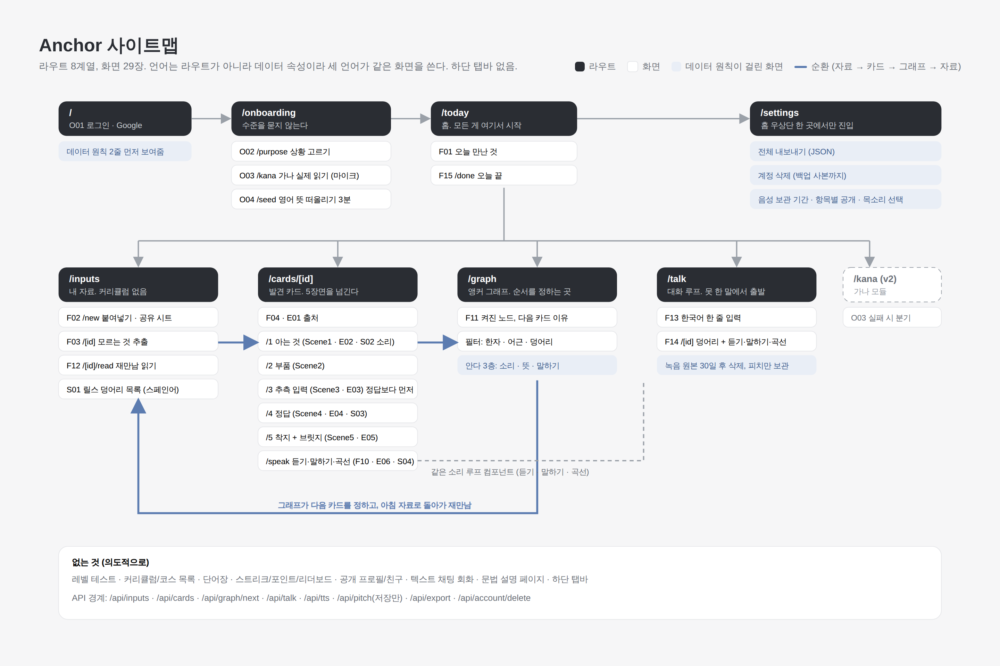

# 사이트맵




세 언어는 같은 화면을 재사용한다. 언어는 데이터 속성이지 라우트가 아니다. 하단 탭바 없음. 설정은 홈 우상단 한 곳.

```mermaid
flowchart TD
  L[/ 로그인] --> O[/onboarding<br/>상황 → 가나 읽기 → 씨앗]
  O --> T[/today 홈]
  T --> I[/inputs 자료]
  T --> C[/cards 발견 카드]
  T --> K[/talk 못 한 말]
  T --> G[/graph 앵커 그래프]
  T --> S[/settings]
  I --> C
  C --> G
  G --> I
```

| 라우트 | 화면 파일 | 하는 일 |
| --- | --- | --- |
| `/` | O01 | Google 로그인. 데이터 원칙 2줄 |
| `/onboarding/purpose` | O02 | 상황 고르기 (수준 질문 없음). 상황을 고른 언어만 켜진다. /settings 에서 다시 들어와 언어를 추가한다 |
| `/onboarding/kana` | O03 | 가나 6개 실제 읽기 (마이크). 일본어를 켰을 때만. 실패 시 가나 모듈로 분기(v2) |
| `/onboarding/kanji` | O05 | 한자 40장 소리 떠올리기 3분 → user_node_state(knows_sound). 일본어를 켰을 때만, 가나 뒤 |
| `/onboarding/seed` | O04 | 영어 뜻 떠올리기 3분 → user_node_state 씨앗. 영어·스페인어를 켰을 때만. 스페인어를 켰으면 스페인어 대응 표시 |
| `/today` | F01 | 오늘 만난 것 큐 |
| `/today/done` | F15 | 하루 끝 요약 |
| `/inputs/new` | F02 | 붙여넣기 / 공유 시트 수신 |
| `/inputs/[id]` | F03 | 모르는 것 추출, 아는 소리로 시작할 것부터 |
| `/inputs/[id]/read` | F12 | 재만남 읽기 (하이라이트) |
| `/cards/[id]` | F04 / E01 / S01 | 카드 출처 |
| `/cards/[id]/1..5` | Scene1–5 / E02–E05 / S02–S03 | 발견 5장면. 추측 입력은 정답보다 항상 먼저 |
| `/cards/[id]/speak` | F10 / E06 / S04 | 듣기 · 말하기 · 곡선 비교 |
| `/graph` | F11 | 앵커 그래프, 다음 카드 이유, 필터 |
| `/talk` | F13 | 못 한 말 한 줄 입력 |
| `/talk/[id]` | F14 | 덩어리 + 음성 루프 |
| `/settings` | — | 언어 켜기·바꾸기, 계정, 전체 내보내기(JSON), 계정 삭제, 음성 보관 기간, 항목별 공개 설정, 목소리 선택 |

API 경계(초안): `/api/inputs` (생성·추출), `/api/cards` (생성·추측 기록), `/api/graph/next` (다음 카드), `/api/talk` (덩어리 생성), `/api/tts`, `/api/pitch` (브라우저 처리가 기본, 서버는 저장만), `/api/export`, `/api/account/delete`.
