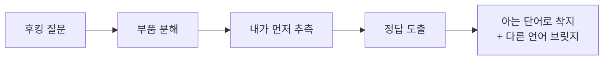
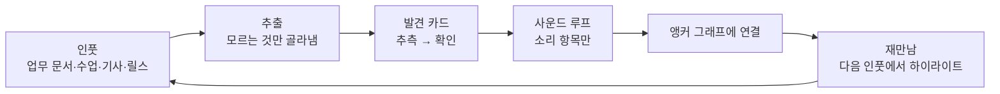

# 언어학습 서비스 기획안

2026-09-20 · @Someone

## 1. 문제 정의

기존 언어학습 서비스는 "가르치는 모델"이고, Jessi는 "발견하는 학습자"다. 이 불일치가 모든 어려움의 근본 원인이다.

**Jessi의 학습 프로필**

| 잘 되는 것 | 안 되는 것 | 원인 |
| --- | --- | --- |
| 어원으로 원리를 이해해 단어 기억 | 단순 암기 | 이유 없는 정보는 저장되지 않음 |
| 그림·구조로 연상 | 글로 설명된 문법 | 남이 정리한 결론을 받는 형태가 안 맞음 |
| 복잡한 프로세스를 구조화·자동화 (업무 강점) | 인토네이션·연음 | 지식으로 접근했지만 실제로는 운동 기능 |
| 세 언어를 동시에 학습 | 지속 | 학습이 일상과 분리된 별도 세션이라서 끊김 |

전제 두 가지를 붙인다. 첫째, 한자는 한국에서 쓰는 한자도 모른다. 단, "협력"·"지능" 같은 한자어는 소리와 뜻으로 안다. 그래서 앵커는 글자가 아니라 소리에 건다. 둘째, 세 언어의 목적은 다르지만 기본 목표는 같다. 대화가 되어야 한다. 읽기·어휘는 대화를 위한 재료다.

**어려움 4개를 한 층 아래로 내리면 3개로 모인다**

1. 전달받은 지식은 남지 않고, 스스로 도출한 지식만 남는다. 문법 텍스트도, 단어장도 같은 이유로 실패한다.
2. 소리는 지식이 아니라 근육이다. 연음 규칙을 "외우려는" 접근 자체가 방향이 틀렸다.
3. 지속이 안 되는 건 의지가 아니라 구조 문제다. 별도 학습 시간이 사라지면 학습도 끝난다.

**기존 서비스가 채우지 못하는 자리**

| 서비스 유형 | 방식 | Jessi에게 안 맞는 이유 |
| --- | --- | --- |
| 듀오링고류 | 맥락 없는 반복 퀴즈 | 이유 없는 반복 = 단순 암기 |
| 교재·문법 앱 | 텍스트 설명 → 연습 | 설명을 받는 형태 |
| 단어 앱(SRS) | 카드 반복 | 연결망 없는 고립된 정보 |
| 회화 앱 | 대화 시뮬레이션 | 소리 피드백이 없거나 텍스트 교정 |
| @hanjacheck류 콘텐츠 | 15초 발견형 릴스 | 방향은 맞지만 랜덤 순서, 복습 없음, 일본어 브릿지 없음, 소비만 함 |

세 언어의 목적이 다르다는 점도 설계 조건이다. 영어는 업무와 학위 수업(필수, 매일 노출), 일본어는 이전 학습의 연장(한자가 병목), 스페인어는 재미(동기는 있지만 노출이 없음).

## 2. 핵심 원칙

서비스의 모든 기능은 아래 4개 원칙 중 하나를 구현한 것이어야 한다. 어느 원칙에도 속하지 않는 기능은 만들지 않는다.

| 원칙 | 한 줄 정의 | 해결하는 문제 | 기존 서비스와 반대인 지점 |
| --- | --- | --- | --- |
| 0. 목표는 대화 | 세 언어 모두 최종 검증은 "말이 되는가". 모든 학습 항목은 말할 상황에서 출발하고 말하기로 끝난다 | 목적이 달라도 공통 기준 | 읽기·퀴즈 중심 |
| 1. 설명하지 말고 발견시켜라 | 규칙·뜻을 먼저 보여주지 않고, 예시를 보고 내가 먼저 추측한 뒤 확인한다 | 문법 텍스트, 단순 암기 | 설명 → 연습 순서를 뒤집음 |
| 2. 아는 것 위에만 쌓아라 | 시작점은 항상 이미 아는 것. 한자는 글자가 아니라 한자어의 소리에, 스페인어는 영어 어근에 | 한자, 어휘량 | 0에서 배운는 항목이 없음 |
| 3. 소리는 덩어리·루프·눈으로 | 연음·인토네이션은 규칙 없이, 덩어리 단위로, 내 소리와 원어민 소리를 겹쳐 보며 반복 | 인토네이션, 연음, 말하기 | 텍스트 설명 0줄 |
| 4. 커리큘럼 대신 내 인풋 | 오늘 실제로 만난 자료와 말해야 했던 상황이 교재. 복습은 카드가 아니라 다음 자료에서의 재만남 | 지속 | 별도 학습 세션이 없음 |

**원칙 1 상세: 발견 루프**

모든 학습 항목은 같은 5단 구조를 따른다. @hanjacheck 릴스의 구조에 "내가 먼저 추측" 단계를 넣은 것이다.

추측 단계가 핵심이다. 틀려도 상관없다. 자기 가설이 수정되는 순간이 기억이 만들어지는 순간이다.

이 다섯 단계는 개념 이름이고, 화면에서는 다른 말로 부른다. 1단계 "후킹 질문"은 화면에서 "아는 단어"(Scene1)다. 화면 문구의 기준은 `docs/FLOW.md` 1장이다.

**원칙 2 상세: 앵커 3종**

| 앵커 | 무엇을 무엇으로 | 예시 |
| --- | --- | --- |
| 한국어 한자어의 소리 → 한자 글자 → 일본어 음독 | 글자는 모르지만 "협력"의 "협"은 안다. 카드 한 장이 소리↔글자↔음독 세 개를 동시에 연결. 음독은 받침 패턴으로 추론 | 협(ㅂ) → 協 → きょう, 학(ㄱ) → 学 → がく |
| 영어 라틴 어근 → 스페인어 | 어미 변환 규칙 | -tion → -ción, -ty → -dad, -ly → -mente |
| 업무 도메인 어휘 → 세 언어 | 이미 쓰는 개념을 세 언어로 | 지능 → 知能 ちのう / intelligence / inteligencia |
| 내가 말해야 했던 상황 → 표현 | 오늘 말하고 싶었는데 못 한 문장이 다음 대화 루프의 재료 | 회의에서 "이건 다음 주로 미루자"를 못 했다 → 그 덩어리부터 |

**원칙 2 보충: 설명은 그 언어 안에서, 쉬운 단어로**

Jessi는 영어를 잘 모를 때도 롱맨 영영사전이 한영사전보다 잘 맞았고, 스페인어는 SpanishDict를 좋아한다. 롱맨은 정의를 기본 단어 약 2,000개 안에서만 쓴다. 즉 "이미 아는 쉬운 단어로 새 단어를 설명"하는 구조다. 이게 원칙 2와 같은 원리다.

서비스에 적용하는 규칙:

| 장면 | 하지 않는 것 | 하는 것 |
| --- | --- | --- |
| 카드의 정답·착지 단계 | 한국어 번역 한 줄 | 그 언어의 쉬운 단어로 된 정의 + 예문 (롱맨 방식) |
| 영어 | — | 정의 어휘를 기본 2,000 단어로 제한. 정의 속 단어는 다 앵커 그래프의 "아는 노드" |
| 스페인어 | 영어 번역만 | SpanishDict처럼 예문 쌍 + 활용 다이얼. 정의는 초기엔 영어 쉬운 단어로, 이후 스페인어로 전환 |
| 일본어 | 한국어 뜻만 | 쉬운 일본어 정의 + よみがな. 한국어는 소리 앵커(협)로만 쓴다 |
| 한국어의 역할 | 설명 언어 | 앵커 전용. 이미 아는 소리·단어를 불러오는 데만 쓴다 |

이렇게 하면 정의 자체가 그 언어의 대화 연습이 된다. "무슨 뜻이야?"를 그 언어로 답하는 게 원칙 0(대화)과도 이어진다.

**원칙 3 상세: 덩어리 단위**

"want to"가 아니라 "wanna"가 하나의 단어다. "did you"가 아니라 "didja"다. 연음 규칙은 서비스 어디에도 텍스트로 등장하지 않는다.

## 3. 서비스 컨셉

**한 줄 정의: 내가 매일 만나는 자료와 못 한 말에서 출발해, 내가 규칙을 발견하고 소리로 꺼내게 맜드는 3개 언어 대화 워크스페이스.**

가르치는 서비스가 아니다. 커리큘럼도, 레벨도, 데일리 퀴즈도 없다. Jessi의 인풋(업무 문서, 수업 자료, 일본어 기사, 스페인어 콘텐츠)이 들어오면 거기서 모르는 것만 뽑아, 발견 루프와 앵커 위에 올려 준다.

**가칭: Anchor** (아는 것에 닻을 내리고 새 것을 끌어온다는 뜻)

**포지셔닝**

| 축 | 기존 서비스 | Anchor |
| --- | --- | --- |
| 교재 | 서비스가 정한 커리큘럼 | 내가 오늘 만난 자료 |
| 학습 형태 | 설명 → 연습 | 추측 → 확인 |
| 언어 단위 | 언어별 별도 코스 | 3개 언어가 한 그래프 |
| 복습 | 카드 반복(SRS) | 다음 자료에서 재만남 |
| 소리 | 텍스트 교정 또는 없음 | 곡선 겹쳐 보기 + 덩어리 반복 |
| 사용 시간 | 별도 세션 | 원래 하던 일 안에서 |

**대상 사용자**

1차 사용자는 Jessi 한 명이다. 단, 데이터 구조는 처음부터 다수 사용자다. Google 로그인으로 계정을 만들고 모든 데이터는 계정별로 분리하며 기본 비공개다. 웹앱으로 만든다. 검증된 후 "이유 없는 정보를 저장하지 못하는 학습자"로 확장할 때 구조를 뒤집지 않기 위해서다.

## 4. 사용자 여정

서비스는 "공부하러 가는 곳"이 아니라 하루 중 세 번 끼어드는 레이어다. 이미 하던 일(업무, 수업, 콘텐츠 소비)을 그대로 하면서 학습이 일어난다.

**하루 예시 (평일)**

| 시간 | Jessi가 하던 일 | 서비스가 끼어드는 방식 | 소요 |
| --- | --- | --- | --- |
| 오전, 영어 이메일 읽기 | 업무 | 브라우저 확장이 지난주 만났던 어근·구조를 하이라이트(재만남). 모르는 단어는 클릭 한 번으로 큐에 넣음 | 0분 (읽는 흐름 유지) |
| 점심 | 휴식 | 큐에 쌓인 항목이 발견 카드 3\~5장으로 도착. 한 장에 30초 | 3분 |
| 오후, 학위 수업 슬라이드 | 수업 | 슬라이드 PDF를 넣으면 문장 구조 블록이 생성. 긴 문장을 블록으로 분해해서 읽기 | 수업 준비 안에서 |
| 통근 | 이동 | 소리 항목만 모아 사운드 루프 5분. 듣고 → 따라 말하고 → 곡선 비교 | 5분 |
| 저녁, 일본어 기사 또는 스페인어 릴스 | 취미 | 모르는 한자는 한국 한자어로 앞서 추론하게 하고, 릴스의 연음 덩어리는 사운드 큐로 | 콘텐츠 소비 안에서 |

별도로 "공부한" 시간은 하루 8분이다. 나머지는 원래 하던 일 안에서 일어난다. 이게 지속성의 근본 해결이다.

## 5. 핵심 모듈 5개

각 모듈은 원칙 하나씩을 담당한다. 앵커 그래프가 중심이고 나머지는 그 위에서 도는 기능이다.

| 모듈 | 담당 원칙 | 하는 일 | 입력 | 출력 |
| --- | --- | --- | --- | --- |
| A. 인풋 레이어 | 4 | 일상 자료와 "오늘 못 한 말"을 서비스로 흘리고, 모르는 것만 골라낸다 | 브라우저 확장, PDF/텍스트 복붙, 음성·영상 링크, "이거 못 말했어" 한 줄 메모 | 학습 큐 (단어·구조·소리·상황 항목) |
| B. 발견 엔진 | 1 | 큐의 항목을 5단 발견 카드로 변환 | 학습 큐 + 앵커 그래프 | 발견 카드 (후킹 → 분해 → 추측 입력 → 정답 → 착지) |
| C. 앵커 그래프 | 2 | 세 언어의 부품(한자 부수, 어근, 문법 구조, 대화 덩어리)과 Jessi가 이미 아는 소리·단어를 하나의 그래프로 보관 | 발견 카드 결과, 한국어 한자어 사전, 어근 사전 | "이미 아는 것과의 거리" → 다음 카드 순서 결정 |
| D. 사운드 루프 | 3 | 소리 항목을 덩어리 단위로 듣기 → 따라 말하기 → 곡선 비교 | 원어민 음성(TTS 또는 실제 클립), 마이크 | 피치·강세 곡선 오버레이, 연음 구간 시각화 |
| E. 대화 루프 | 0, 3 | 내가 실제로 말해야 하는 상황(회의, 수업 질문, 여행)을 음성으로 연습. 텍스트 교정 없음. 막힌 덩어리는 D로, 몰랐던 단어는 B로 보낸다 | 상황 한 줄 + 내 음성 | 말한 것과 말하려던 것의 차이, 다음 연습할 덩어리 |
| F. 재만남 | 4 | 다음 인풋이나 다음 대화에서 이미 발견한 부품이 나오면 하이라이트. 안 나오는 건 인접 부품 카드로 자연스럽게 다시 등장 | 앵커 그래프 + 새 인풋 | 하이라이트, 다음 카드 순서 |

**대화 루프(E)가 왜 따로 있는가**

발견 카드는 재료를 만들고, 사운드 루프는 소리를 몸에 붙이고, 대화 루프는 그걸 실제 상황에서 꺼내는 연습이다. 세상의 대화 앱과 다른 점은 세 가지다. 주제를 앱이 정하지 않고 오늘 내가 못 한 말에서 시작한다. 틀린 문법을 텍스트로 교정하지 않고, 막힌 덩어리를 사운드 루프로 보낸다. 한 번 말한 덩어리는 앵커 그래프에 "말해본 것"으로 기록돼서 다음 대화에서 재만남이 일어난다.

**대화 루프에 차용한 것: Rikus English E-Guide (Derek Driggs)**

기조는 그대로 두고, 이 가이드에서 네 가지만 가져온다. 가이드는 "한국어 상황 → 영어 표현" 순서로 9개 파트, 세션당 4단(상황 떠올리기 → 언제 쓰는지 → 영어로 시도 → 소리 내서 말하기)으로 되어 있다. 문법 X, 암기 X는 우리와 같다.

| 차용 | 가이드에서 | 우리 서비스에서 |
| --- | --- | --- |
| 덩어리의 단위 = 한국어 말끝·태도 | \~하는 것 같다, \~할 텐데, \~거든, \~잖아요 같은 표현을 하나의 영어 덩어리(It seems like, I'm sure you're, you know)에 대응 | "못 한 말"의 대부분은 단어가 아니라 태도 표현이다. 덩어리 사전을 한국어 말끝 기준으로 인덱싱한다. 이게 가장 강한 한국어 앵커다 |
| 기능 분류 9종 | 내적 태도 / 기억 / 의도 / 능력 / 제안 / 원인 / 설명 / 확인 / 강조 | 세 언어 공통의 덩어리 분류 축으로 쓴다. 영어 "It seems like"와 일본어 "〜みたい"와 스페인어 "Parece que"가 같은 노드 아래에 붙는다 |
| 후킹은 상황 장면 | "회의 시작 5분 만에 팀장이 '이건 배경 설명이고요'" → 한국어로 뭐라고 하지? | 대화 덩어리 카드의 후킹은 영어가 아니라 한국어 상황이다. "이 상황에서 나는 한국어로 뭐라고 하나"를 먼저 인식시키고, 그 다음 추측 |
| Level Up = 같은 덩어리의 강도 3단 | I'm sure you're tired → pretty worn out → running on very little rest | 앵커 그래프에서 덩어리 노드의 인접 노드를 "강도 축"으로 둔다. 하나 말해본 뒤 다음 카드는 같은 태도의 한 단계 윗버전 |

가이드의 "Culture Point / Keep in mind" 코너는 1\~3줄짜리 뉴앙스 메모다(예: 영어에서 I think는 독단적이 아니라 책임감 있게 들릱다). 우리 원칙은 설명 0줄이지만, 이건 문법이 아니라 "직역하면 왜 위험한가"라 예외로 둔다. 카드 착지 단계에 접힌 상태로 한 줄만, 열어야 보인다.

가져오지 않는 것: 고정된 Part 1→9 순서(우리는 인풋과 그래프가 순서를 정한다), 텍스트 가이드 형식, 예문 읽고 따라 말하기만 있고 소리 피드백이 없는 점.

**앵커 그래프가 왜 중심인가**

기존 SRS는 항목을 고립된 카드로 다룬다. 이 서비스는 항목을 그래프의 노드로 다룬다. 노드 = 부품(力, spect, は/が) 또는 단어. 엣지 = "이 부품이 이 단어에 들어간다", "이 한국 한자음은 이 음독과 대응한다", "이 영어 어근은 이 스페인어 단어와 같다".

이렇게 하면 세 가지가 자동으로 해결된다.

1. 다음 카드 순서: 이미 아는 노드에서 가장 가까운 모르는 노드부터. 항상 "아는 것 + 1"만 배운다.
2. 복습 없는 복습: 力을 배운 뒤 加, 助, 動이 나오면 力이 저절로 다시 보인다. 카드를 다시 보여줄 필요가 없다.
3. 세 언어 통합: 영어 spect 노드와 스페인어 inspeccionar 노드가 같은 그래프에 있으니 한 언어에서 배운 게 다른 언어 진도로 잡힌다.

**발견 카드 화면 구성 (한 장 = 한 화면, 스크롤 없음)**

| 단계 | 화면에 보이는 것 | 텍스트 양 |
| --- | --- | --- |
| 후킹 | 필요한 질문 한 줄 ("協力의 協, 力이 왜 세 개?") | 1줄 |
| 분해 | 부품이 도형으로 분리되는 애니메이션. 이미 아는 부품은 초록, 모르는 건 회색 | 0줄 |
| 추측 | 입력창 하나. 뜻 또는 읽기를 적는다. 건너뛰기 가능 | 내가 쓴 것 |
| 정답 | 내 추측과 정답이 나란히. 부품이 합쳐지는 애니메이션 | 단어 하나 |
| 착지 | 이미 아는 단어 2\~3개 + 다른 언어 브릿지 + 장면 이미지 | 단어만 |

## 6. 언어별 적용

모듈은 공통이지만 "부품"과 "앵커"가 언어마다 다르다. 이 표가 각 언어 모듈의 스펙이다.

| 항목 | 영어 | 일본어 | 스페인어 |
| --- | --- | --- | --- |
| 공통 목표 | 대화 | 대화 | 대화 |
| 추가 목적 | 업무·학위 수업 (필수) | 이전 학습 연장 | 재미 |
| 대화 상황 (대화 루프의 출발점) | 회의 발언, 수업 질문, 이메일을 말로 하기 | 일상 대화, 여행, 콘텐츠 감상 후 감상 말하기 | 여행, 음식, 가벼운 잡담 |
| 주 인풋 | 이메일, 수업 슬라이드, 논문, 회의 | 기사, 자막 있는 영상 | 릴스, 노래, 드라마 |
| 단어 부품 | 라틴·그리스 어근·접사 | 한자 부수·구성요소 | 라틴 어근 (영어와 공유) |
| 1차 앵커 | 이미 아는 영어 단어 (업무 어휘) | 한국어 한자어의 소리 (글자 아님) + 소리→음독 패턴 | 영어 라틴계 단어 + 어미 변환 규칙 |
| 문법 블록 표현 | 절 단위 블록, 시제는 타임라인 점·막대 | 조사를 커넥터 모양으로, 활용은 블록 끝 색 변화 | 동사 = 어간 + 어미 다이얼(인칭을 돌리면 어미가 바뀜) |
| 소리 단위 | 강세 리듬 (큰 점·작은 점) + 연음 덩어리 | 고저 악센트 (계단 모양) | 음절 박자 (균등한 점) + 연음(sinalefa) |
| 사운드·대화 루프 비중 | 높음 | 높음 | 높음 (단어보다 먼저) |
| 표기 | — | 한자가 학습 대상으로 나오는 자리에는 よみがな. 항목을 가리키는 이름표로 쓰인 한자에는 달지 않는다 (`CLAUDE.md` 디자인 시스템) | — |

**언어 간 브릿지 (앵커 그래프의 교차 엣지)**

| 브릿지 | 방향 | 감소하는 학습량 |
| --- | --- | --- |
| 한국어 → 일본어 | 한자어의 소리(협, 학, 산) → 글자 → 음독 추론 | 글자는 새로 배우지만, 읽기와 뜻은 이미 아는 소리에서 따라온다. 한 글자당 외울 게 3개에서 1개로 |
| 영어 → 스페인어 | 라틴계 영어 단어 → 어미 변환 | 스페인어 단어장의 상당 부분이 "이미 아는 것"으로 분류됨 |
| 영어 ↔ 일본어 | 업무 개념 (지능, 데이터, 시나리오) | 개념은 하나, 표현만 세 개 |
| 세 언어 공통 | 대화 상황 템플릿 (인사, 제안, 거절, 미루기) | 상황은 하나, 덩어리만 세 언어 |

일본어 한자음 → 음독 패턴 예시 (서비스는 이 표를 보여주지 않고, 카드 순서를 통해 스스로 발견하게 한다):

| 한국어 받침 | 일본어 음독 끝 | 예 |
| --- | --- | --- |
| ㄱ | く / き | 学 학 → がく, 国 국 → こく |
| ㄴ | ん | 山 산 → さん, 神 신 → しん |
| ㅂ | う (장음) | 協 협 → きょう, 十 십 → じゅう |
| ㄹ | つ / ち | 発 발 → はつ, 一 일 → いち |
| ㅇ | う / い (장음) | 運 운 → うん, 営 영 → えい |

## 6.5 진입 조건과 온보딩

앵커 그래프는 "아는 것 + 1"로 동작하므로, 첫날에는 아는 노드를 채워야 한다. 단, 레벨 테스트도 자기 보고도 쓰지 않는다. 본인이 아는 자기 수준은 실제와 다를 수 있고, 그걸 본인이 판단하기는 어렵다. 그래서 "아는가?"를 묻지 않고 실제 행동으로만 채운다.

**언어별 바닥 (진입 조건)**

| 언어 | 바닥 | 바닥 아래일 때 | 온보딩에서 확인하는 방법 |
| --- | --- | --- | --- |
| 공통 | 한국어 화자 (한자어 소리를 이미 암) | 현재 범위 밖 | 묻지 않음 |
| 영어 | 알파벳, 기초 문장 | 현재 범위 밖 | 묻지 않음. 한국 정규 교육이면 넘는 것으로 본다 |
| 스페인어 | 없음 (알파벳을 영어와 공유) | — | 묻지 않음. 아는 것은 영어 그래프에서 코그네이트로 넘어옴 |
| 일본어 | 없음. 가나는 진입 조건이 아니라 첫 카드 직전에 한 번 확인하는 것 | 카드를 잠그지 않는다. 가나 모듈(v2) 예고 1장을 보이고 그대로 첫 카드로 간다 | "읽을 수 있나요?"가 아니라 가나 6개를 보여주고 소리 내서 읽게 함. 마이크 인식으로 판정 |

**가나 모듈 (v2, 구조만 미리 잡음)**

같은 5장면 구조를 쓴다. 앵커는 한국어 소리(か・き・く = 카·키·쿠), 부품은 글자의 기원 한자(安 → あ, 加 → か/カ, 伊 → イ). 소리는 이미 알고 모양만 모른다는 점에서 한자 카드와 같은 구조다. 재만남은 붙여넣은 일본어 자료 위에 모르는 가나에만 한국어 소리를 얹고, 날이 갈수록 얹힌 게 줄어드는 방식. 하루 5장이면 약 2주.

**언어는 세트가 아니라 하나씩 켠다**

세 언어를 한 번에 시작하지 않아도 된다. 첫 화면에서 시작할 언어를 고른다(여러 개 가능, 최소 1). 언어를 켜면 준비 단계 없이 바로 그 언어의 자료 넣기로 간다. 나중에 홈이나 설정에서 다른 언어를 켜도 같다. 그래프는 언어 공통 테이블이므로 나중에 켠 언어도 이미 아는 노드(예: 영어 어근 → 스페인어 코그네이트) 위에 바로 올라간다.

**"아는 것"은 미리 채우지 않고, 실제 자료에서 채운다**

첫 한 주 동안 아는 노드를 채우는 자리는 뽑기 화면(F03)이다. 넣은 자료에서 뽑힌 한자·어근마다 "알아 / 몰라" 한 탭으로 판정하고, 카드의 추측 결과가 그 위에 보정을 얹는다. 미리 40장을 돌리는 씨앗 단계는 두지 않는다(`docs/FLOW.md` 5장). 40장 데이터(`db/seed/`)는 공용 노드로 남아 후킹·음독 패턴의 재료로 쓰인다.

| 켠 언어 | 첫 카드 전에 필요한 것 | 이유 |
| --- | --- | --- |
| 영어 | 없음 | 못 한 말 한 줄이 곧 첫 재료 |
| 일본어 | 가나 6개 읽기 (첫 카드 직전 1회, 30초) | 실제로 읽어 보는 자리다. 못 읽어도 카드는 잠그지 않는다 — 가나 모듈(v2) 예고 1장을 보이고 그대로 첫 카드로 간다. 카드 안의 읽기는 F10 에서 소리로 들려주므로 글자를 못 읽어도 카드가 성립한다. 마이크 미지원·거부는 통과가 아니라 "다음에 다시 확인"으로 남긴다(자기 보고로 통과시키지 않음) |
| 스페인어 | 없음 | 스페인어 앵커는 영어 라틴 어근. 영어를 전혀 읽지 못하는 사용자는 현재 범위 밖이며, 스페인어만 켠 사용자에게는 이 전제를 자료 넣기 화면에서 한 줄로 알린다 |

한자의 "아는가"는 **일본어 읽기**가 떠오르는지로 본다. 한국어 한자어 소리는 한국어 화자면 이미 아는 것(아래 "안다는 세 층")이라 묻지 않고, 발견 카드의 후킹에서만 쓴다. 음독은 받침 → 음독 패턴(받침 없음 → ㄴ·ㅁ→ん → ㄱ→く → ㅂ→う → ㄹ→つ → ㅇ→う/い)으로 묶여 있어, 규칙 표를 보여주지 않아도 카드 순서만으로 패턴이 드러난다. 판정 결과는 `knows_meaning`으로, `knows_sound`(한국어 한자어 소리)는 한국어 화자 기본값 true 다.

**첫 방문 (로그인에서 첫 카드까지 4화면, 5분 안. 순서·문구는 `docs/FLOW.md`)**

| 화면 | 하는 일 | 왜 자기 보고가 아닌가 |
| --- | --- | --- |
| 1. 로그인 | Google 로그인. 데이터는 계정별로 분리, 기본 비공개 | 첫 사용자는 Jessi 하나지만, 구조는 처음부터 다수 계정 |
| 2. 언어 고르기 | 영어·일본어·스페인어 중 시작할 언어를 탭 (여러 개 가능). 나머지는 나중에 홈·설정에서 켠다 | 언어를 고르는 것이지 수준을 고르는 게 아님 |
| 3. 자료 넣기 | 기사·문장·한자어 하나를 붙여넣는다. 빈 손이면 예시 자료 1개를 탭 한 번으로 | 교재가 아니라 내 자료 |
| 4. 뽑기 | 아는 소리에서 시작할 것부터. 한자마다 "알아 / 몰라" | 실제 자료의 실제 항목에 대한 판정. 목록을 미리 외우게 하지 않는다 |
| 4′. 가나 읽기 (일본어, 첫 카드 직전 1회) | 가나 6개를 보고 소리 내서 읽기 | "읽을 수 있다"고 말하는 대신 실제로 읽는다 |
| 5. 첫 카드 | 후킹 → 부품 → 내가 먼저 추측 → 정답 → 아는 단어로 착지 → 말하기 | 추측이 먼저 |

온보딩이 끝나도 그래프는 불완전하다. 첫 일주일은 카드의 추측 결과 자체가 보정이다. 맞추면 인접 노드까지 "아마 아는 것"으로 올리고, 틀리면 내린다. 본인이 쓴 이메일·슬라이드를 넣으면 그 안의 단어는 "쓴 적 있음"으로 자동 등록된다.

**"안다"는 세 층이다**

| 층 | 예 (協) | 그래프에서 |
| --- | --- | --- |
| 소리를 안다 | "협력"의 협 | 한국어 화자면 기본 켜짐 |
| 뜻과 글자를 안다 | 協 = 힘을 합쳠 돕다 | 카드에서 추측이 맞으면 켜짐 |
| 말할 수 있다 | 協力을 맞는 억양으로 | 사운드 루프 일치도가 기준 넘으면 켜짐 |

## 6.6 데이터 원칙: 잃지 않는다, 보이지 않는다

열심히 학습한 게 사라지면 사용자는 즉시 이탈하고 다시 돌아오지 않는다. 그리고 자기 수준에 만족하지 못하는 사람은 학습 과정이 공개되는 걸 원하지 않는다. 이 둘은 기능이 아니라 전제다.

| 원칙 | 구체적으로 |
| --- | --- |
| 계정 분리 | Google 로그인. 모든 테이블에 user\_id, DB 레벨 Row Level Security. 사용자 1명일 때도 똑같이 |
| 기본 비공개 | 그래프, 추측 기록, 음성, 인풋 전부 본인만. 공개 프로필·리더보드·친구 기능 없음. 공개는 항목 단위로 본인이 명시적으로 누를 때만 |
| 음성 | 녹음은 계정 전용 저장소에 암호화 저장. 곡선 비교에 필요한 피치 데이터만 남기고 원본은 **기본 30일** 후 삭제(사용자가 설정에서 바꾼다). 이 기간이 숫자로 적히는 곳은 여기 한 곳이고, 다른 문서는 이 줄을 가리킨다 |
| 백업 | 세 층: Neon PITR(몇 분 전으로 되돌리기) · 배포 전 스냅샷(마이그레이션 사고) · Neon 밖 매일 JSON 백업(최악의 경우). 각 층의 보존 기간과 복구 절차는 `docs/BACKUP.md`. 분기마다 실제로 복구 테스트 |
| 내보내기 | 언제든 내 데이터 전체를 한 번에 내려받을 수 있음(JSON). 서비스가 사라져도 학습 기록은 남는다 |
| 삭제 | 계정 삭제 시 모든 데이터와 백업 속 사본까지 지운다. 복구 불가를 명시 |
| 플랫폼 | 웹앱(PWA). 네이티브 앱 아님. 설치 없이 폰·데스크톱 어디서든 같은 계정으로 |
| 로컬 임시 저장 | 오프라인이거나 저장 실패 시 브라우저에 임시 보관 후 재전송. 추측 한 번, 녹음 한 번도 유실 없음 |

## 7. 하지 않을 것

기존 서비스의 핵심 기능 대부분을 의도적으로 만들지 않는다. 하나라도 넣으면 "가르치는 모델"로 돌아간다.

| 만들지 않는 것 | 이유 | 대신 |
| --- | --- | --- |
| 커리큘럼·레벨·코스 | 배울 순서를 서비스가 정하면 인풋과 분리된다 | 앵커 그래프가 "아는 것 + 1"로 순서 결정 |
| 문법 설명 텍스트 | 설명을 받는 형태 자체가 안 맞음 | 예문 블록 → 추측 → 구조 겹치기 |
| 단어장·플래시카드 반복 | 고립된 반복 = 단순 암기 | 그래프 인접 카드를 통한 자연 재등장 |
| 연음·발음 규칙 문서 | 소리는 지식이 아니라 근육 | 덩어리 듣기 + 곡선 비교 |
| 스트리크·포인트·리더보드 | 외부 보상은 별도 세션을 전제로 함 | 인풋 안에 끼어들기 |
| 텍스트 채팅형 회화·문법 교정 | 대화는 소리 문제. 텍스트 교정은 말하기를 못 바꾼다 | 음성 대화 루프 (모듈 E) + 막힌 덩어리를 사운드 루프로 |
| 한자 쓰기·필순 | 대화에 필요 없고 암기 부담만 큼 | 읽기와 소리 연결만 |
| 다수 사용자 대응 (초기) | Jessi 한 명에게 먼저 검증 | 검증 후 확장 |

## 8. 성공 지표

"많이 썼나"가 아니라 "내가 바뀐 게 있나"를 재는 지표만 둔다. 매주 한 번 확인한다.

| 지표 | 재는 방법 | 왜 이 지표인가 |
| --- | --- | --- |
| 추측 정답률 (처음 보는 부품 조합에 대해) | 발견 카드 추측 단계 기록 | 올라가면 "외우는 것"에서 "추론하는 것"으로 바뀐 것 |
| 재만남 인식률 | 하이라이트된 항목을 클릭 없이 지나가는 비율 | 카드 없이 기억이 유지되는지 |
| 인풋 유입 일수 / 주 | 인풋 레이어로 자료가 들어온 날 | 지속성의 직접 지표. "앱 연 날"이 아니라 "삶이 흘러들어온 날" |
| 사운드 루프 곡선 일치도 추이 | 같은 덩어리의 1회차 vs N회차 | 인토네이션·연음이 실제로 몸에 붙는지 |
| 앵커 그래프에서 "아는 노드" 비율 | 그래프 스냅샷 | 만나는 자료에서 모르는 것이 줄어드는지 |

검증 실패 기준도 미리 정한다. 4주 후 인풋 유입 일수가 주 3일 미만이면 인풋 레이어 설계가 틀린 것이고, 추측 정답률이 올라가지 않으면 부품 분해 단위가 틀린 것이다.

## 9. 로드맵

각 단계는 가설 하나만 검증한다. 검증이 실패하면 다음 단계로 가지 않고 설계를 바꾼다.

이 장은 **무엇을 검증하는가**를 정한다. 만드는 순서는 `docs/TEAM.md` 4장이 정한다.

| 단계 | 기간 | 만드는 것 | 검증하는 가설 | 통과 기준 |
| --- | --- | --- | --- | --- |
| MVP | 3주 | 두 축. (1) 영어 대화 루프 초기판: 오늘 못 한 말 한 줄 → 덩어리 → 듣고 따라 말하고 곡선 비교. (2) 일본어 한자 발견 카드 + 앵커 그래프 | "추측 → 확인"이 암기보다 남는다. 곡선 비교가 말하기를 바꾼다 | 재만남 인식률 70%, 같은 덩어리 5회차 일치도 상승 |
| v0.5 | 2주 | 인풋 레이어 (브라우저 확장 + "못 한 말" 모바일 메모) + 재만남 하이라이트 | 인풋이 일상에서 자동으로 들어오면 지속된다 | 인풋 유입 주 4일 이상, 4주 연속 |
| v1 | 4주 | 대화 루프 완성 (상황 기반 음성 주고받기, 영·일·서) | 음성 대화에서 막힌 덩어리가 사운드 루프를 거치면 다음 대화에서 나온다 | 막혔던 덩어리의 재사용률 |
| v1.5 | 4주 | 영어 어근 + 스페인어 브릿지, 문법 블록 | 같은 발견 구조가 세 언어에 다 통한다 | 영어 카드 추측 정답률이 일본어와 비슷한 추이 |
| v2 | 미정 | 이미지 연상 자동 생성, PDF·영상 인풋, 다수 사용자 | 확장 가능성 | — |

**MVP를 두 축으로 잡는 이유**

1. 대화가 기본 목표라면 말하기 루프가 첫 버전에 없으면 안 된다. 영어를 넣는 건 매일 말해야 하는 상황이 있어 인풋이 끊기지 않기 때문이다.
2. 한자는 Jessi가 가장 어렵다고 한 영역이고, 소리 앵커가 실제로 작동하는지 가장 빨리 확인할 수 있다. 한국 한자를 모른다는 전제에서도 먹히는지가 핵심 검증이다.
3. 부품 분해 데이터(한자 구성요소, 한국 한자음, 음독)와 음성 기술(TTS, 피치 검출)이 둘 다 공개로 있다.

**MVP 범위 (이것만)**

- [ ] 영어: "오늘 못 한 말" 한 줄 입력 → 자연스러운 덩어리 1\~2개 생성 → 원어민 음성 → 따라 말하기 → 두 곡선 겹쳐 보기
- [ ] 영어: 덩어리를 앵커 그래프에 "말해본 것"으로 기록
- [ ] 첫 방문: 로그인 → 언어 → 자료(예시 1개) → 뽑기 → 첫 카드까지 5분 안, 404 없음, 어느 화면에서도 홈까지 2탭
- [ ] 일본어: 한국어 한자어 또는 일본어 문장 입력 → 모르는 한자 추출 → 한자마다 알아/몰라
- [ ] 일본어: 한자 1개 = 발견 카드 1장. 후킹은 항상 이미 아는 한국어 단어에서 ("협력의 협, 어떤 모양일까?")
- [ ] 앵커 그래프: 한국어 소리 노드, 글자 노드, 부수 노드, 음독 패턴 엣지, 덩어리 노드
- [ ] 다음 카드 순서 = 아는 노드에서 가장 가까운 모르는 노드
- [ ] 추측 정답률·재만남·곡선 일치도 기록
- [ ] 모바일 화면 우선 (통근·점심에 쓰므로)

## 10. 기술 구성과 열린 질문

지금 연결된 도구로 외부 서비스 추가 없이 다 만들 수 있다.

| 영역 | 선택 | 이유 |
| --- | --- | --- |
| 플랫폼 | 웹앱 (Next.js, 모바일 우선 PWA) | 설치 없이 폰·데스크톱 어디서든. 네이티브 앱 아님 |
| 배포 | Vercel | 연결됨 |
| DB | Neon Postgres | 앵커 그래프는 노드·엣지 테이블 2개로 충분. 모든 테이블에 user\_id, Row Level Security로 계정 간 분리 |
| 인증 | Neon Auth (Google OAuth) | 첫날부터 다수 계정 구조. 사용자 1명이어도 로그인 필수 |
| 백업 | Neon PITR + 배포 전 스냅샷 + Neon 밖 매일 JSON 백업 (`docs/BACKUP.md`) | 학습 기록 유실 = 즉시 이탈. 한 층이 놓친 경우를 다음 층이 막는다. 분기마다 복구 테스트 |
| 음성 저장 | 계정 전용 암호화 스토리지, 원본은 일정 기간 뒤 삭제 (기간은 6.6 데이터 원칙) | 목소리는 가장 민감한 데이터 |
| 부품 분해·카드 생성 | Claude API | 한자 분해, 어근 분해, 후킹 질문 생성, 문법 블록화. 사용자 자료는 학습에 쓰지 않는 설정으로 호출 |
| 정의 생성 | Claude API + 정의 어휘 제한 (영어 기본 2,000어, 일본어는 よみがな 필수) | 롱맨 방식의 쉬운 정의를 자동 생성. 정의 속 단어가 모르는 노드면 그 단어부터 카드로 |
| 한자 데이터 | KANJIDIC2, 한국 한자음 사전, 한자 구성요소 DB(IDS) | 공개 데이터. 음도 패턴 엣지는 여기서 자동 생성 |
| 어근 데이터 | 영어·스페인어 어원 사전 (공개) | 영↔서 브릿지 엣지 |
| 음성 | ElevenLabs TTS + Jessi 본인 목소리 클론(voice\_id pwjMkbtUbj1hBa0RkN5N), Web Audio API + 피치 검출 라이브러리 | 사운드·대화 루프. 목표 발음을 "내 목소리로 말한 버전"으로 들려주면 내 곡선과 비교할 때 음색 차이가 없어 인토네이션 차이만 남는다. 브라우저에서 끝남 |
| 인풋 레이어 | 브라우저 확장 (v0.5), 모바일 공유 시트, "못 한 말" 메모 | 읽던 흐름을 안 끊는 게 핵심 |
| 이미지 | ElevenLabs 이미지 생성 (v2) | 착지 장면 이미지 |

**열린 질문**

1. 한국 한자 글자를 모르는 상태에서 "소리 앵커"만으로 글자가 기억에 남는가. MVP의 가장 큰 검증 질문. 안 남으면 부수 그림 연상을 v2에서 MVP로 당긴다.
2. 대화 루프의 상대를 AI 음성으로 할지, 내가 한 번 말하고 끝내는 단방향으로 할지. 초기판은 단방향으로 잡았다.
3. 추측 단계를 건너뛰게 허용할지. 허용하면 퍸해서 매번 건너뛰고, 그러면 그냥 릴스가 된다.
4. 영어 인풋의 종류. 업무 이메일을 브라우저 확장으로 읽는 건 보안 이슈가 있을 수 있다. "못 한 말 메모"만으로 시작할지.
5. 사운드 루프의 "원어민 음성"을 TTS로 할지 실제 클립으로 할지. TTS는 연음이 실제보다 깨끗할 수있다.
